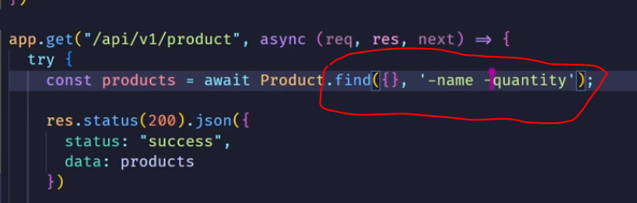
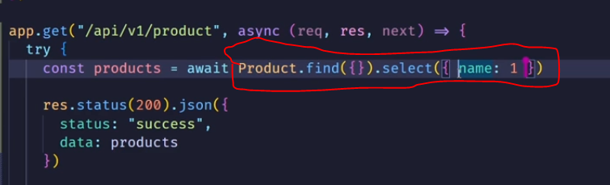

st=> 3/12/2023, 4:46:56 PM  
com=> 

> mongoose enum 

=> mi me => middlewares instance method => pre po => this func => before saving =>  post after saving  => 
we can insert method => 

> ### mongoose query => same as mongodb query little change 

> mongoose projection 

User snippets vvi 